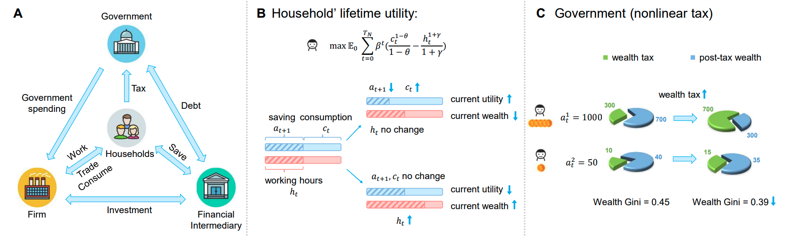
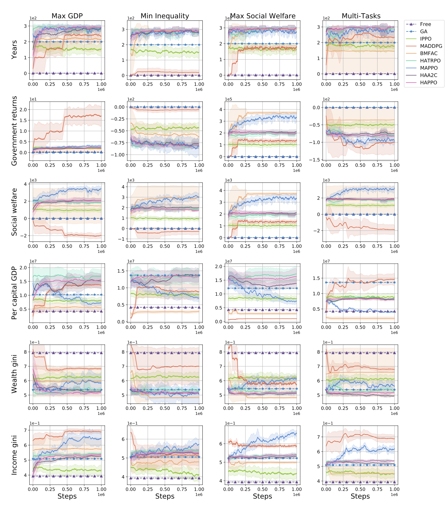
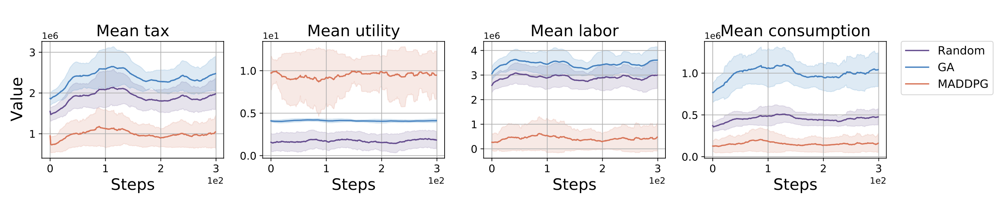
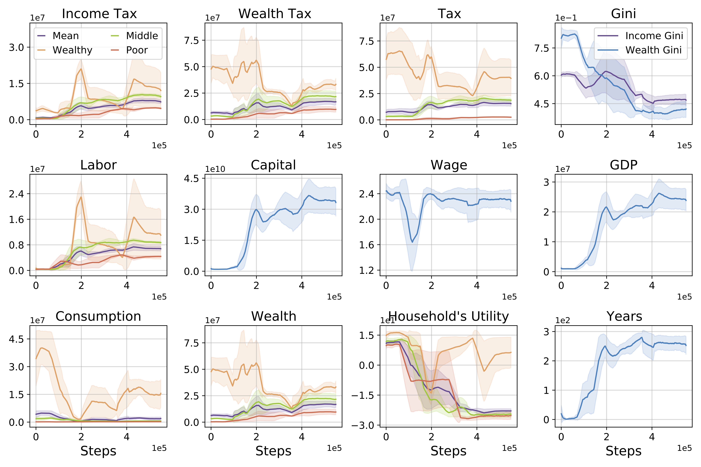

# TaxAI: A Dynamic Economic Simulator and Benchmark for Multi-Agent Reinforcement Learning

<div style="text-align:center">
  
  <figcaption style="text-align:center;"></figcaption>
</div>


The optimization of fiscal policies by governments to stimulate economic growth, ensure social equity and stability, and maximize social welfare has been a subject of significant interest. Simultaneously, individuals keenly observe government policies to optimize their own production and saving strategies. 

To simulate this problem, we propose a multi-agent reinforcement learning simulator based on the Bewley-Aiyagari model. Our simulator encompasses various economic activities of governments, households, technology, and financial intermediaries. By integrating reinforcement learning algorithms, it enables the derivation of optimal strategies for governments and individuals while facilitating the study of the relationship between government policies, micro-level household behaviors, and macroeconomic phenomena.

### A comparison of MARL simulators for optimal taxation problems

| Simulator             | AI Economist | RBC Model  | **TaxAI** (ours) |
|-------------------------|--------------|--------------|---------------------|
| Households' Number    | 10           | 100        | 10000               |
| Tax Schedule          | Non-linear   | Linear     | Non-linear          |
| Tax Type              | Income       | Income     | Income & Wealth & Consumption  |
| Social Roles' Types   | 2            | 3          | 4                   |
| Saving Strategy       | &#x2716;    | &#x2714;| &#x2714;         |
| Heterogenous Agent    | &#x2714;     | &#x2714;| &#x2714;         |
| Real-data Calibration | &#x2716;    | &#x2716;  | &#x2714;         |
| Open source           | &#x2714;  | &#x2716;  | &#x2714;         |
| MARL Benchmark        | &#x2716;    | &#x2716;  | &#x2714;         |

Our paper: 

TaxAI: A Dynamic Economic Simulator and Benchmark for Multi-Agent Reinforcement Learning 
[https://arxiv.org/abs/2309.16307](https://arxiv.org/abs/2309.16307)

## Install

You can use any tool to manage your python environment. Here, we use conda as an example.

1. Install conda/miniconda.

2. Build a Python virtual environment.
```bash
conda create -n TaxAI python=3.8
```

3. Activate the virtual environment

```bash
conda activate TaxAI
```

4. Clone the repository and install the required dependencies
```bash 
git clone https://github.com/jidiai/TaxAI.git
cd TaxAI
pip install -r requirements.txt
```

## Execution
After installation, run an example experiment by executing the following command from the home folder:
```bash
python run_a_game.py
```
or run python code as follows:

```python
from env.env_core import economic_society
from omegaconf import OmegaConf

yaml_cfg = OmegaConf.load(f'./cfg/default.yaml')  # get environment parameters
env = economic_society(yaml_cfg.Environment)

# get the action max
gov_action_max = env.government.action_space.high[0]
house_action_max = env.households.action_space.high[0]

# global obs is observed by gov & households; Private obs are observed separately by each household.
global_obs, private_obs = env.reset()

for _ in range(100):
    gov_action = env.government.action_space.sample()
    house_action = env.households.action_space.sample()

    action = {env.government.name: gov_action * gov_action_max,  # gov_action & house_action is in (-1,+1)
              env.households.name: house_action * house_action_max}
    next_global_obs, next_private_obs, gov_reward, house_reward, done = env.step(action)
    print("gov reward:", gov_reward, "\nhouseholds reward:", house_reward)

    if done:
        global_obs, private_obs = env.reset()
env.close()
```
If users obtain a similar output as follows, it indicates a successful installation of the TaxAI simulator.
```text
gov reward: 0.27574195559515985 
households reward: [[-14.16824042]
 [ 13.33342979]
 [  7.38537561]
 [ 10.8789686 ]
 [-16.69487928]
 [ 10.96102371]
 [-27.29789107]
 [ 11.32268419]
 [-24.14579232]
 [  9.87050757]]
gov reward: -0.028681460944447557 
households reward: [[  7.08354761]
 [ -7.66086619]
 [  4.4566605 ]
 [-19.19874515]
 [  5.28689801]
 [ 10.49161175]
 [  8.16525891]
 [  7.82208646]
 [ -2.99427493]
 [ -1.13584677]]
 ......
```

## Algorithms Benchmark
We support traditional economic methods and multiple MARL algorithms on benchmark scenarios.


### Scenarios
We design 4 tasks in TaxAI, and users can design different weights when optimizing multiple tasks.
```bash
gov_task: "gdp"  # choices: {"gdp", "gini", "social_welfare", "gdp_gini"}
```
- **Maximizing GDP Growth Rate**: The economic growth can be measured by Gross Domestic Product (GDP). Without considering imports and exports in an open economy, GDP is equal to the output $Y_t$ in our model. 
Based on reality, we set the government's objective to maximize the GDP growth rate.

- **Minimizing Social Inequality**: Social equality and stability build the foundation for all social activities. Social inequality is usually measured by the Gini coefficient of wealth distribution $\mathcal{W}_t$ and income distribution $\mathcal{I}_t$. The Gini coefficient is calculated by the ratio of the area between the Lorenz curve and the perfect equality line, divided by the total area under the perfect equality line(shown in figure~\ref{fig:markov game}). The Gini coefficient ranges between 0 (perfect equality) and 1 (perfect inequality).

- **Maximizing Social Welfare**: Social welfare is an important indicator to present the happiness of the population, which is computed by the sum of all households' lifetime utility.

- **Optimizing Multiple Tasks**: If the government aims to simultaneously optimize multiple objectives, we weigh and sum up multiple objectives. 

### Supported algorithms

(1) Traditional Economic Methods: 
- Free Market Policy
- Genetic Algorithm (GA)

(2) Independent Learning: 
- Independent PPO

(3) Centralized Training Distributed Execution (CTDE): 
- MADDPG
- MAPPO

(4) Heterogeneous-Agent Reinforcement Learning (HARL): 
- HAPPO
- HATRPO
- HAA2C

(5) Mean Field Multi-Agent Reinforcement Learning (MF-MARL): 
- Bi-level Mean Field Actor-Critic (BMFAC)


### Train agents

1. Train free-market agents.
```bash
cd TaxAI
python main.py --n_households 10 --alg "rule_based" --task "gdp" --seed 2 --hidden_size 128 --q_lr 3e-4 --p_lr 3e-4 --batch_size 128
python main.py --n_households 10 --alg "rule_based" --task "gini" --seed 2 --hidden_size 128 --q_lr 3e-4 --p_lr 3e-4 --batch_size 128
python main.py --n_households 10 --alg "rule_based" --task "social_welfare" --seed 2 --hidden_size 128 --q_lr 3e-4 --p_lr 3e-4 --batch_size 128
python main.py --n_households 10 --alg "rule_based" --task "gdp_gini" --seed 2 --hidden_size 128 --q_lr 3e-4 --p_lr 3e-4 --batch_size 128
```

2. Train IPPO agents.
```bash
cd TaxAI
python main.py --n_households 10 --alg "ppo" --task "gdp" --seed 2 --hidden_size 128 --q_lr 3e-4 --p_lr 3e-4 --batch_size 128
python main.py --n_households 10 --alg "ppo" --task "gini" --seed 2 --hidden_size 128 --q_lr 3e-4 --p_lr 3e-4 --batch_size 128
python main.py --n_households 10 --alg "ppo" --task "social_welfare" --seed 2 --hidden_size 128 --q_lr 3e-4 --p_lr 3e-4 --batch_size 128
python main.py --n_households 10 --alg "ppo" --task "gdp_gini" --seed 2 --hidden_size 128 --q_lr 3e-4 --p_lr 3e-4 --batch_size 128
```

3. Train MADDPG agents.
```bash
cd TaxAI
python main.py --n_households 10 --alg "maddpg" --task "gdp" --seed 2 --hidden_size 128 --q_lr 3e-4 --p_lr 3e-4 --batch_size 128
python main.py --n_households 10 --alg "maddpg" --task "gini" --seed 2 --hidden_size 128 --q_lr 3e-4 --p_lr 3e-4 --batch_size 128
python main.py --n_households 10 --alg "maddpg" --task "social_welfare" --seed 2 --hidden_size 128 --q_lr 3e-4 --p_lr 3e-4 --batch_size 128
python main.py --n_households 10 --alg "maddpg" --task "gdp_gini" --seed 2 --hidden_size 128 --q_lr 3e-4 --p_lr 3e-4 --batch_size 128
```

4. Train BMFAC agents.
```bash
cd TaxAI
python main.py --n_households 10 --alg "bmfac" --task "gdp" --seed 2 --hidden_size 128 --q_lr 3e-4 --p_lr 3e-4 --batch_size 128
python main.py --n_households 10 --alg "bmfac" --task "gini" --seed 2 --hidden_size 128 --q_lr 3e-4 --p_lr 3e-4 --batch_size 128
python main.py --n_households 10 --alg "bmfac" --task "social_welfare" --seed 2 --hidden_size 128 --q_lr 3e-4 --p_lr 3e-4 --batch_size 128
python main.py --n_households 10 --alg "bmfac" --task "gdp_gini" --seed 2 --hidden_size 128 --q_lr 3e-4 --p_lr 3e-4 --batch_size 128
```


5. Train HARL/MAPPO agents.
Details is shown in TaxAI/HARL/README.md


## TaxAI Simulator

### Partially Observable Markov Games

<div style="text-align:center">
  
  <figcaption style="text-align:center;"></figcaption>
</div>

We model the problem of optimizing tax policies for the government and developing saving and working strategies for households as multiplayer general-sum Partially Observable Markov Games (POMGs).


- Global information: the average assets $\bar{a}_t$, income $\bar{i}_t$, and productivity level $\bar{e}_t$ of the 50\% poorest households and 10\% richest households, along with the wage rate $W_t$.

- Private information: household's personal assets $\{a^i_t\}$ and productivity level $\{e^i_t\}$.

#### Government agent:
- Government observation: global information

- Govornment action: takes tax and spending actions $\{\tau_t, \xi_t, \tau_{a,t}, \xi_{a,t}, r^G_t\}$.

#### Household agent:
*UPDATE!*

Household's Reward Function:

$$
r_f^i =\text{Sigmoid}(\frac{{c_t^i}^{1-\theta}}{1-\theta}-\frac{{h_t^i}^{1+\gamma}}{1+\gamma})
$$

- Household observation: global + private information
- Household action: savings and workings actions $\{p^i_t, h^i_t\}$.

### Key Improvements 

1. To bridge the gap between economic models and the real world, we opt to calibrate TaxAI using [2013 SCF data](https://www.federalreserve.gov/econres/scf_2013.htm).
2. To mitigate the curse of dimensionality associated with high-dimensional state information, we draw inspiration from [the World Inequality Report 2022](https://wir2022.wid.world/) and employ grouped statistical averages for households as a representation of this high-dimensional state information.
3. In response to the abundance of constraints, we introduce the concept of proportional actions, facilitating control over the range of actions to adhere to these constraints.

### Economic Assumption
- Social roles, such as households and government, are considered rational agents.
- Households are not allowed to incur debt and engage only in risk-free investments.
- The labor productivity of households is categorized into two states: normal state and super-star state. The dynamic changes in each state follow an AR(1) process.
- The capital market, goods market, and labor market clear.
- The technology firm represents all enterprises and factories, producing a homogeneous good, and follows the Cobb-Douglas production function.
- The financial Intermediary operates without arbitrage.

### Teriminal Conditions
We will terminate the current episode under the following circumstances:
- If the maximum number of steps in an episode is reached.
- If the Gini coefficient of income or wealth exceeds a threshold;
- If the Gross Domestic Product (GDP) is insufficient to cover the total consumption of households (C_t + G_t > Y_t).
- In the event of household bankruptcy (a_t^i < 0).
- If the calculation of households' or government's rewards results in an overflow or leads to the appearance of NaN (Not-a-Number) values. 

### Timing Tests

The following table shows the number of dynamics evaluations per second in a single thread.
Results are averaged over 10 episodes on AMD EPYC 7742 64-Core Processor with GPU GA100 [GRID A100 PCIe 40GB].

|Algorithm | N=10 |  N=100 |  N=1000 |  N=10000 |  
|------|-----|-----|-----|-----|
|Number of steps  |1799.927|482.335|46.983|4.018|
|num of episodes  |6.289|1.689|0.157|0.013|
|episode length  |285.900|285.400|300.000|300.000|


## Experiment Results

### 1. Comparative Analysis of Multiple Baselines
We benchmark 9 baselines on 4 distinct tasks, with the training curves and test results of macroeconomic indicators shown as follows.

- Macroeconomic Perspectives: Different algorithms also differ in terms of convergence solutions.
<div style="text-align:center">
  
  <figcaption style="text-align:center;"></figcaption>
</div>

|Baselines |Years| Average social welfare|Per capital GDP | Wealth gini |Income gini|
|------| ------| ------| ------| ------| -----|
|Free market| 1.0 | 2.9 | 4.3e6 | 0.79 |**0.39**|
|GA| 200.0 | 6.9 | 1.2e7 |   0.54 | 0.52 |
|IPPO| 162.7 | 1035.5 | 8.4e6 |0.62 | 0.44 |
|MADDPG| 204.2 | 1344.6 | 1.0e6 |0.61| 0.58 |
|MAPPO| 274.5 | 3334.7 | 7.3e6  | 0.61 | 0.65 |
|HAPPO| 298.7 | 1986.0  |  1.6e7 |  0.52 | 0.54 |
|HATRPO| **300.0**|  1945.0 | **1.7e7**  | 0.52 |  0.54|
|HAA2C| **300.0** | 2113.3 | 1.4e7  | 0.51| 0.53 |
|BMFAC|292.8 | **3722.2**  | 2.8e6  |  **0.48**| 0.50 |


- Microeconomic Perspectives: MADDPG households exhibit tax evasion behavior and attain the highest utility.
<div style="text-align:center">
  
  <figcaption style="text-align:center;"></figcaption>
</div>


### 2. Economic Analysis of MARL Policy
1. MADDPG converges towards the highest GDP while compromising social welfare under maximizing GDP task;
2. Different wealth groups adopt distinct strategies.
<div style="text-align:center">
  
  <figcaption style="text-align:center;"></figcaption>
</div>

|Households’ groups  | Income tax | Wealth tax | Total tax | Labor supply  | Consumption | Wealth | Income  | Per year utility |
|-----|-----|----|----|----|----|----|----|----|
|The wealthy        | 1.9 e6   | **1.0e7**    | **1.2e7**   | 2.3e6      | **4.4e7**     | **5.3e7** | 5.5 e6  | **8.7**    |
|The middle class   | **5.7 e6**   | 3.0 e6   | 8.7e6   | **7.1e6**      | 6.4e5     | 2.1e7 | **7.2 e6**  | -24.1   |
|The poor           | 2.8 e6   | 1.2e6    | 4.0e6   | 4.9e6      | 2.3e5     | 9.2e6 | 4.6 e 6 | -25.6      |
|Mean value         | 3.8 e6   | 2.9 e6   | 6.7e6   | 5.5e6      | 4.8e6     | 1.8e7 | 5.7 e 6 | -22.7     |


### 3. Scalability of Environment

|Algorithm | N=10      | N=100     | N=1000    | N=10000   |
|--------|-----------|-----------|-----------|-----------|
|Free Market  | 1.3e6     | 4.3e6     | 3.9e6     | 4.0e6     |
|GA| **1.7e8** | 1.5e7     | NA        | NA        |
|IPPO  | 5.0e6     | 1.6e7     | 1.7e7     | 1.6e7     |
|MADDPG   | 3.2e6     | 1.1e7     | 1.7e7     | **1.7e7** |
|MAPPO | 6.1e6     | 7.3e6     | 1.2e7     | NA        |
|HAPPO | 1.8e7     | 1.6e7     | 1.5e7     | NA        |
|HATRPO | 3.2e7     | **1.7e7** | **2.0e7** | NA        |
|HAA2C  | 1.6e7     | 1.4e7     | 1.6e7     | NA        |
|BMFAC   | 4.0e6     | 1.2e7     | 1.2e7     | NA        |


## Acknowledgement

[Reinforcement-learning-algorithms](https://github.com/TianhongDai/reinforcement-learning-algorithms)

[MADDPG](https://github.com/starry-sky6688/MADDPG)

[HARL](https://github.com/PKU-MARL/HARL)

## Contact
If you have any questions about this repo, feel free to leave an issue. 
You can also contact current maintainers Qirui Mi by email miqirui2021@ia.ac.cn.
