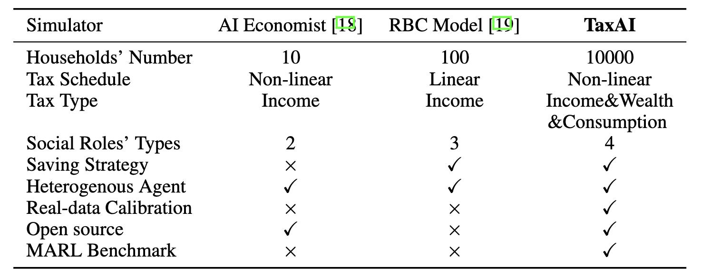
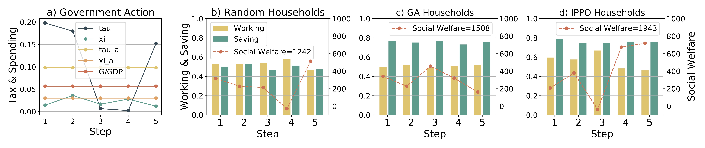

# TaxAI: A Dynamic Economic Simulator and Benchmark for Multi-Agent Reinforcement Learning

<div style="text-align:center">
  
  <figcaption style="text-align:center;"></figcaption>
</div>


The optimization of fiscal policies by governments to stimulate economic growth, ensure social equity and stability, and maximize social welfare has been a subject of significant interest. Simultaneously, individuals keenly observe government policies to optimize their own production and saving strategies. 

To simulate this problem, we propose a multi-agent reinforcement learning simulator based on the Bewley-Aiyagari model. Our simulator encompasses various economic activities of governments, households, technology, and financial intermediaries. By integrating reinforcement learning algorithms, it enables the derivation of optimal strategies for governments and individuals while facilitating the study of the relationship between government policies, micro-level household behaviors, and macroeconomic phenomena.

### A comparison of MARL simulators for optimal taxation problems

<div style="text-align:center">
  
  <figcaption style="text-align:center;"></figcaption>
</div>


## Installation

```bash
git clone https://github.com/jidiai/TaxAI.git
```


## Requirements

1. Build a Python virtual environment

   ```bash
   conda create -n TaxAI python=3.6
   ```

2. Activate the virtual environment

   ```bash
   conda activate TaxAI
   ```

3. Install the requirements package

   ```bash 
   pip install -r requirements.txt
   ```


## Run

```bash
cd TaxAI
python main.py --device-num 0 --n_households 10 --alg "ppo" --task "gdp" --seed 2 --hidden_size 128 --q_lr 3e-4 --p_lr 3e-4 --batch_size 128
```

alg = {
        Free market policy: "rule_based",
        Independent PPO: "ppo",
        MADDPG: "maddpg",
        BMFAC: "bmfac" }

task = {max GDP:"gdp", min Gini: "gini", max social welfare: "social_welfare", multi-task: "gdp_gini"}

   "device-num" means GPU index


## Env API

The TaxAI API's API models environments as simple Python `env` classes. Creating environment instances and interacting with them is very simple- here's an example using the "gdp" environment:
you can change government task in './cfg/default.yaml'.

```bash
gov_task: "gdp"  # choices: {"gdp", "gini", "social_welfare", "gdp_gini"}
```

```python
from env.env_core import economic_society
from omegaconf import OmegaConf

yaml_cfg = OmegaConf.load(f'./cfg/default.yaml')  # get environment parameters
env = economic_society(yaml_cfg.Environment)

# get the action max
gov_action_max = env.government.action_space.high[0]
house_action_max = env.households.action_space.high[0]

# global obs is observed by gov & households; Private obs are observed separately by each household.
global_obs, private_obs = env.reset()

for _ in range(100):
    gov_action = env.government.action_space.sample()
    house_action = env.households.action_space.sample()

    action = {env.government.name: gov_action * gov_action_max,  # gov_action & house_action is in (-1,+1)
              env.households.name: house_action * house_action_max}
    next_global_obs, next_private_obs, gov_reward, house_reward, done = env.step(action)
    print("gov reward:", gov_reward, "\nhouseholds reward:", house_reward)

    if done:
        global_obs, private_obs = env.reset()
env.close()
```
If users obtain a similar output as follows, it indicates a successful installation of the TaxAI simulator.
```text
gov reward: 0.27574195559515985 
households reward: [[-14.16824042]
 [ 13.33342979]
 [  7.38537561]
 [ 10.8789686 ]
 [-16.69487928]
 [ 10.96102371]
 [-27.29789107]
 [ 11.32268419]
 [-24.14579232]
 [  9.87050757]]
gov reward: -0.028681460944447557 
households reward: [[  7.08354761]
 [ -7.66086619]
 [  4.4566605 ]
 [-19.19874515]
 [  5.28689801]
 [ 10.49161175]
 [  8.16525891]
 [  7.82208646]
 [ -2.99427493]
 [ -1.13584677]]
 ......
```
## Markov Game

<div style="text-align:center">
  
  <figcaption style="text-align:center;"></figcaption>
</div>

The Markov game between the government and household agents. In the center of the figure, we display the Lorenz curves of households' wealth distribution.  The global observation consists of the average assets $\bar{a}_t$, income $\bar{i}_t$, and productivity level $\bar{e}_t$ of the 50\% poorest households and 10\% richest households, along with the wage rate $W_t$. For the government agent, it observes the global observation and takes tax and spending actions $\{\tau_t, \xi_t, \tau_{a,t}, \xi_{a,t}, r^G_t\}$ through the actor network. For household agents, they observe both global and private observation, including personal assets $\{a^i_t\}$ and productivity level $\{e^i_t\}$, and generate savings and workings actions $\{p^i_t, h^i_t\}$ through the actor network. The actor network structure in the figure is just an example.


## Experiment Results

### 1. Optimal Solution in Dynamic Game

<div style="text-align:center">
  
  <figcaption style="text-align:center;"></figcaption>
</div>

### 2. Households Dynamic Responses

<div style="text-align:center">
  
  <figcaption style="text-align:center;"></figcaption>
</div>

### 3. Scalability of Environment

<div style="text-align:center">
  
  <figcaption style="text-align:center;"></figcaption>
</div>

### 4. AI-based Policy Analysis

<div style="text-align:center">
  
  <figcaption style="text-align:center;"></figcaption>
</div>


### 5. Training Curves

<div style="text-align:center">
  
  <figcaption style="text-align:center;"></figcaption>
</div>

## Acknowledgement

[Reinforcement-learning-algorithms](https://github.com/TianhongDai/reinforcement-learning-algorithms)

[MADDPG](https://github.com/starry-sky6688/MADDPG)
